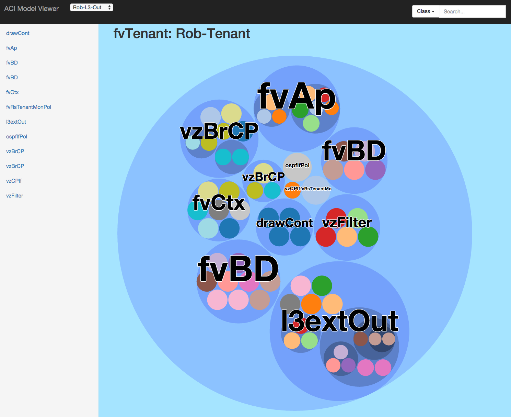

# aci-model-viewer
Visualizes the ACI Model of a given configuration using D3.js

Note: This project is unfinished. There will be bugs, missing information, and unimplemented features. 

It's main purpose is to demonstrate what can be accomplished using the APIC API and D3.js

## Usage
Clone the repo:
`git clone https://github.com/robertcorreiro/aci-model-viewer.git`

Run the viewer locally using:
`python -m SimpleHTTPServer`. 

Then browse to localhost:8000.

Three examples are provided by default.

## Building Data
The `build_data.py` creates the JSON file read by `app.js`. D3.js expects the json as objects containing children arrays to represent the hierarchy.

1. Edit this file to provide credentials for your ACI fabric.
2. Specify the root of your tree and the filename for the output file.
3. The script will gather every object under the root.
4. Move the file to the examples directory.
4. Edit the index.html file to include an option to select your newly created file.
